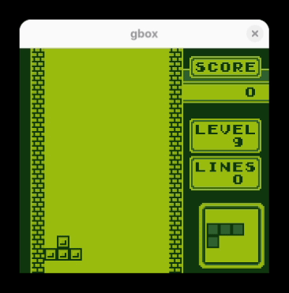
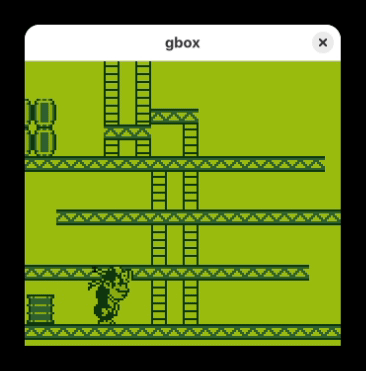
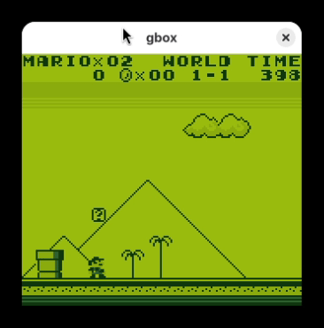

# Gamebox

A cross-platform Game Boy (DMG) emulator written in C, designed to run on both
desktop systems and resource-constrained microcontrollers.

<p align="left">
  
  
  
</p>

## Features

- **CPU**: full SM83 instruction set, passes Blargg's `cpu_instrs` test ROM
- **PPU**: scanline-based renderer with background, window and sprite support
- **Cartridges**: ROM only, MBC1, MBC1+RAM, MBC1+RAM+BATTERY
- **Boot ROM**: optional DMG boot ROM support (`ENABLE_BOOT_ROM` CMake option)
- **Input**: joypad with interrupt support
- **Timer / interrupts**: DIV, TIMA/TMA/TAC and the full interrupt dispatch
- **Serial**: debug output over the serial port (used by test ROMs)

## Architecture

The emulator core is fully platform-agnostic. All platform services (ROM
access, input, video output, audio, timing) go through a single callback
interface defined in `include/gamebox/gamebox.h`:

```c
struct platform {
    void *(*open)(const char *rom);
    void (*close)(void *rd);
    uint8_t (*read)(void *rd, uint8_t *buf, uint8_t bid);

    uint8_t (*poll_input)(void);
    void (*submit_line)(uint8_t *line, uint8_t ly);
    void (*submit_audio)(uint8_t *audio);

    void (*delay)(uint8_t ms);
    void (*serial_debug)(uint8_t c);
};
```

A platform registers its callbacks with `gb_register_platform()`, calls
`gb_init()`, then drives the emulator one frame at a time with
`gb_run_frame()`. ROM data is loaded on demand in 16 KB banks through the
`read` callback, so the core never needs the whole ROM in memory — a key
requirement for MCU targets. Rendered scanlines are pushed out through
`submit_line`, one line at a time, which maps naturally onto both desktop
framebuffers and SPI LCD controllers.

```
gamebox/
├── core/        # platform-independent emulator core (CPU, PPU, MBC, bus, devices)
├── include/     # public API (gamebox/gamebox.h)
├── platforms/   # platform layers (Linux/raylib today, MCU ports planned)
├── assets/      # demo media
└── tests/       # test resources
```

## Supported Platforms

- [x] Linux (raylib)
- [ ] MacOS
- [ ] MCU
  - [ ] STM32
  - [ ] RP2040
  - [ ] RP2350
  - [ ] ESP32

## Building (Linux)

Requirements:

- CMake >= 3.28
- A C compiler (GCC or Clang)
- [raylib](https://www.raylib.com/)

```sh
cmake -B build
cmake --build build
```

The DMG boot ROM is enabled by default; pass `-DENABLE_BOOT_ROM=OFF` to skip
the boot animation.

## Running

```sh
./build/platforms/gamebox path/to/rom.gb
```

### Controls

| Game Boy | Keyboard    |
| -------- | ----------- |
| D-Pad    | `W A S D`   |
| A        | `O`         |
| B        | `K`         |
| Select   | `Space`     |
| Start    | `Enter`     |

## Roadmap

- APU (audio) emulation
- MBC3 / MBC5 cartridge support and battery-backed save persistence
- PPU accuracy improvements (dmg-acid2)
- Timer accuracy improvements (mooneye-gb test suite)
- MCU ports with SD-card ROM selection menu

## License

Licensed under the [GNU General Public License v3.0](./LICENSE).
